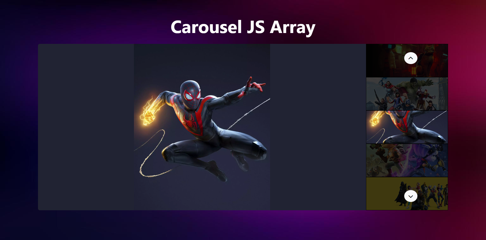

# Carousel
**Initial commit:** 14/03/23

**Technologies:** Vue.js, Javascript, Axios, HTML, CSS, SASS e Bootstrap.

**Info**: :camera: This repository contains three different carousels. Each carousel has buttons for scrolling through images and thumbnails for previewing them.

  
   
  

 
## Exercises list
- [x] **1. Carousel JS Array** &rarr; `JS-plain` the images are stored in an Array.
- [x] **2. Carousel JS Objects** &rarr; `JS-plain` the carousel scrolls images and their related titles/descriptions, which are contained in an Array-Literal.
- [x] **3. Carousel Vue Array** &rarr; `Vue.js` like the previous exercise but the code is significantly lightened by the `data-binding` of Vue.js
